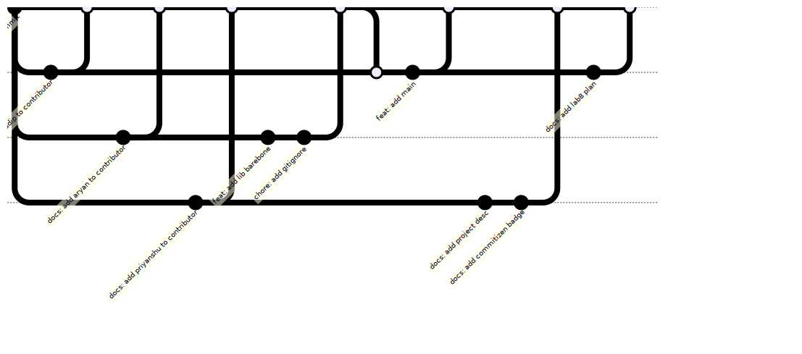

# NDT7 Client/Library

[ndt7](https://www.measurementlab.net/tests/ndt/ndt7) library & client implementation in Rust

> Course Project for CS699 @ [IIT Bombay](https://www.cse.iitb.ac.in)

## Lab8 Plan

## Contributors

- [Arghyadip](https://www.cse.iitb.ac.in/~arghyadip)
- [Aryan](https://www.cse.iitb.ac.in/~aryankhilwani)
- [Priyanshu](https://www.cse.iitb.ac.in/~priyanshusingh)
